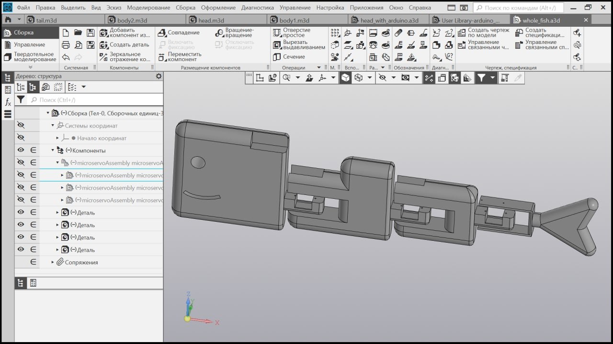
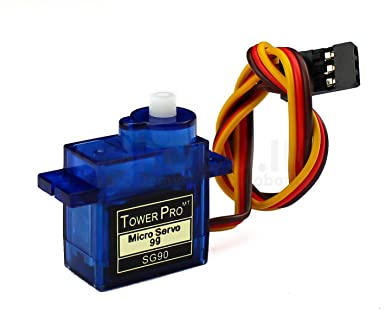

# RoboFish

Idea of this project is robot-fish which can moves using servomotors which controlled via bluetooth by arduino nano

I am used Compas-3d for 3d modeling my RoboFish. Here what I got

To make details move I am used servomotors like this

and write [algorithm](main_controller.c): how exactly each servo should be moving for robot pushes forward, left or right
